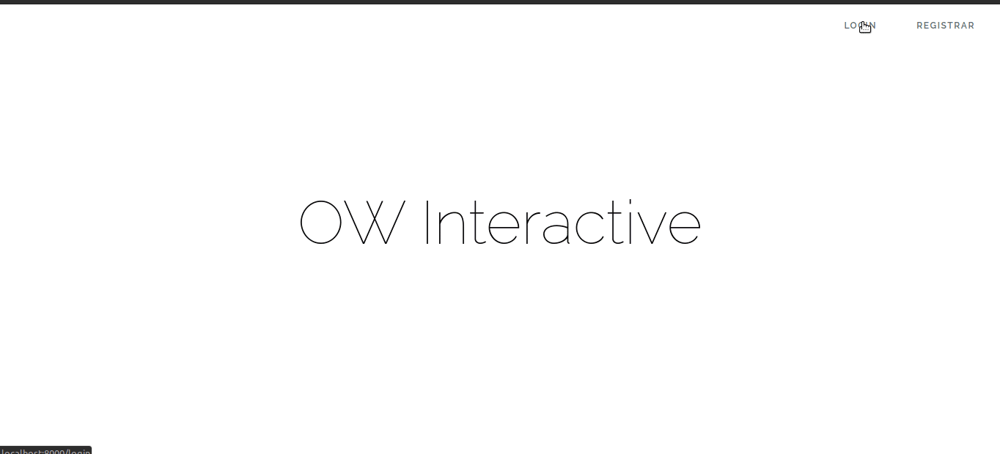

### Install Dependencies

All 3rd-party dependencies are managed with the [Composer][composer]  and [npm][npm] managers.
If you have installed Composer globally, as recommended, you can simply run:

```
composer install
npm install
```

### Preping the application

As any new [Laravel][lararel] install there is a couple steps to perform in order to get it going. If you are nunfamiliar follow [these instrunctions](https://laravel.com/docs/6.x/#web-server-configuration)

- Adjust your .env file

- Run migrate database:
```
php artisan migrate
```
- If you want to run factory data:

```
php artisan db:seed
```

- Run key generate:

```
php artisan key:generate
```

### Run the Application

The simplest way to run the app is through the `artisan server`, which relies on the built-in PHP server.
To start the web server, run the following command from the project's root directory:

```
php artisan serve
```

You can then browse to [http://localhost:8000](http://localhost:8000) in your web browser.

### Demo the Application



## Challenge Requirements

The Challenge app requirements will be sent by email, for they change accordinly to the opportunity

## Contact

For more information about opportunities check  [here](https://trampos.co/oportunidades?lc=ow)

[composer]: https://getcomposer.org
[npm]: https://www.npmjs.com/
[git]: http://git-scm.com/
[fork]: http://lmgtfy.com/?q=how+to+fork+a+repo+in+github
[php]: http://php.net
[laravel-challenge]: https://github.com/owinteractive/laravel-challenge
[Laravel]: http://www.laravel.com/docs/5.4
